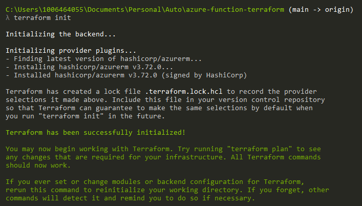
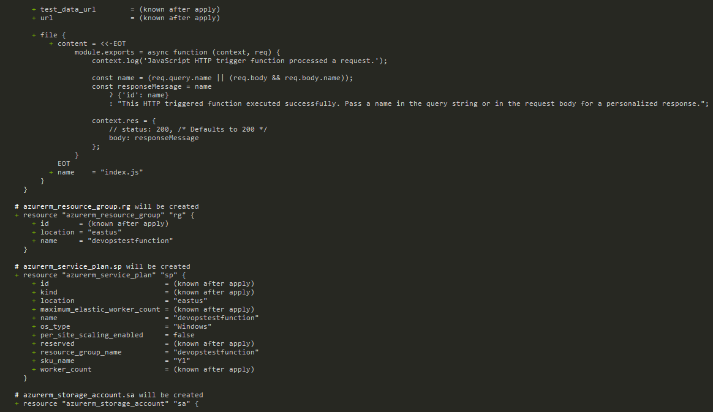
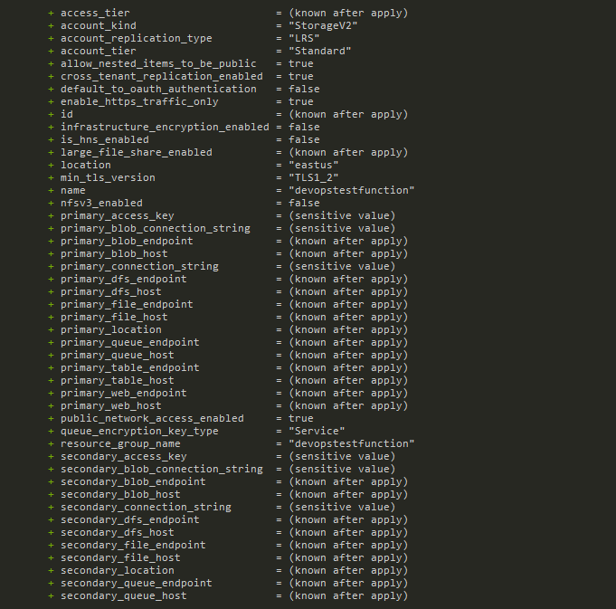
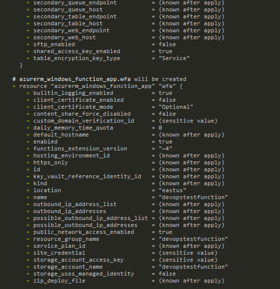
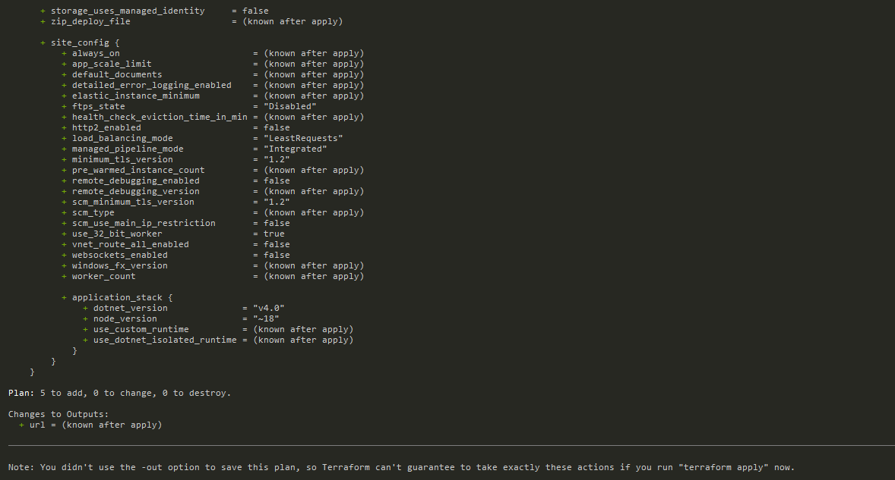
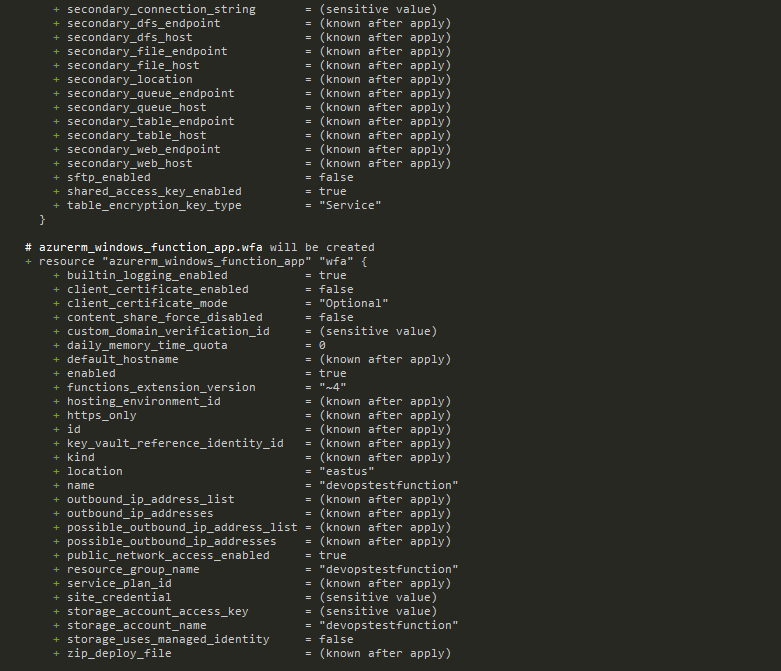
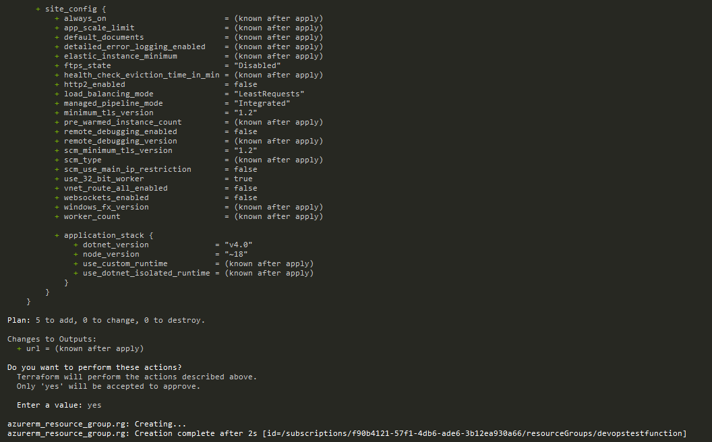
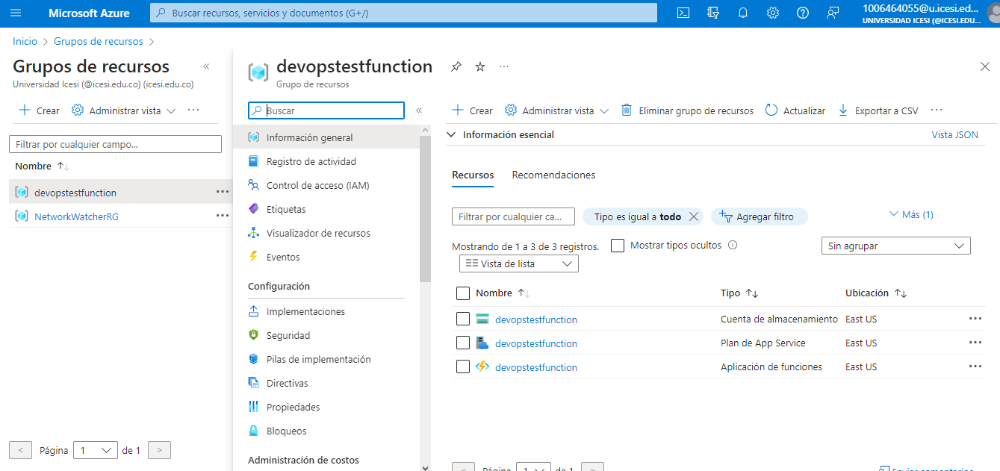

# Guía de Uso de Terraform

## Descripción

Este repositorio contiene la configuración de Terraform para desplegar y gestionar la infraestructura de forma automatizada en la nube. Terraform es una herramienta de código abierto de HashiCorp que permite definir y provisionar infraestructura como código.

## Requisitos Previos

Antes de comenzar, asegúrate de tener instalado lo siguiente:

<div style="text-align: left">
    <p>
        <a href="https://www.terraform.io/downloads.html" target="_blank"> </a>
        <a href="https://learn.microsoft.com/es-es/cli/azure/install-azure-cli-windows" target="_blank"> </a>
    </p>
</div>

## Versionado

El sistema de versionado del proyecto se realizo con las siguientes herramientas:

<div style="text-align: left">
    <a href="https://git-scm.com/" target="_blank"> </a>
    <a href="https://github.com/" target="_blank"> </a>
</div>

## Configuración

1. Clona este repositorio en tu máquina local:

   ```bash
   git clone https://github.com/cuatrosr/azure-function-terraform.git
   cd azure-function-terraform
   ```

2. Configura tus credenciales de proveedor de nube.

   ```bash
   az login
   ```

## Uso

1. Inicializa Terraform en el directorio del proyecto:

   ```bash
   terraform init
   ```

   

2. Visualiza los cambios propuestos antes de aplicarlos:

   ```bash
   terraform plan
   ```

   
   
   
   
   

3. Aplica los cambios en la infraestructura:

   ```bash
   terraform apply
   ```

   Confirma la aplicación escribiendo "yes" cuando se te solicite.

   
   
   
   
   
   

## Azure

Luego, podras observar en tu cuenta de azure el grupo de recursos creado y la funcion corriendo en la url del output:
    
    

## Mantenimiento

Para realizar cambios en la infraestructura, modifica los archivos de configuración de Terraform y sigue los pasos de uso anteriores para aplicar los cambios.

## Limpieza

Para destruir la infraestructura creada por Terraform y liberar recursos:

```bash
terraform destroy
```

## Recursos Adicionales

- [Documentación oficial de Terraform](https://www.terraform.io/docs/index.html)
- [Comunidad de Terraform](https://www.terraform.io/community)
